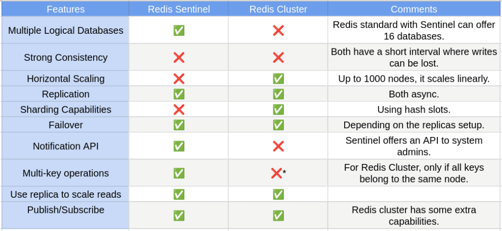

# Processes
## Concept
- A running instance of a program is called a process and it runs in its own memory space. Each time you execute a command, a new process starts. An active processs also includes the resources the program needs to run. These resources are are managed by the operating system(heap, process registers, program counters)
- Each process has its own memory adress space and one process cannot corrupt the memory space of another process. 

-  A process is an active entity as opposed to a program, which is considered to be a passive entity.
-  A new process is created only when running an executable file (not when running Shell builtin commands).
- Process properties:
    + PID (Process ID) - a unique positive integer number 
    + User
    + Group
    + Priority / Nice
- Type of Processes:
+ Parent
+ Child
+ Daemon
+ Zombie (defunct): a terminated child process that remains in the system's process table while waiting for its parent process to collect its exit status
+ Orphan: A process whose parent process no more exists i.e. either finished or terminated without waiting for its child process to terminate 
## Thread
- A Thread is a unit of execution within a process. A process has at least  one thread. It is called the main thread. 
- Each has it own stack and it is possible to communicate between threads using shared memory space. However, a misheaving thread can bring down the entire process
## How CPU run a thread or process on a CPU
- This is handled by context switching. When one process is switched out of the CPU so another process can run
- The operating system stores the state of the current running process so the process can be retored and resume execution at a later point
- In then restores the previously state of other process and resumes execution of that process.
- Context switching is really expensive. It involves saving and loading of registers, switching out memory of pages and updating various kernal data structures.
- Switching execution between threads also requires context switching but it's faster because there are few state to track and there is no need to switch out virtual memory pages which is one of the most expensive operations during a context switch.
- Some other mechanisms: fiber or coroutine
# Cron
## Anacron: 
# Mount disk

# Database
## Scaling
### Denormalization
### Archive
### Partition
MySQL supports several types of partitioning methods, each with its own characteristics and use cases. Here are the main types of partitioning supported by MySQL:

- Range Partitioning: With range partitioning, rows are distributed across partitions based on the range of values in a specified partitioning key column. For example, you could partition a table of sales data based on the sales date, with each partition representing a specific time period (e.g., monthly or yearly partitions).

- List Partitioning: List partitioning allows you to explicitly define which rows belong to each partition based on discrete values in a partitioning key column. For instance, you could partition a table of customer data based on the country or region of each customer.

- Hash Partitioning: Hash partitioning distributes rows across partitions based on a hash function applied to one or more columns. This method can help evenly distribute data across partitions, which can be useful for load balancing and preventing hotspots.

- Key Partitioning: Key partitioning is similar to hash partitioning but uses a hash function applied to the columns used in the table's primary key or unique key. This method is suitable for tables with unique keys that are not sequential.

- Composite Partitioning: Composite partitioning allows you to use a combination of partitioning methods, such as range-hash or range-list partitioning. This can provide more flexibility in partitioning large tables.

### Sharding
- Range-Based Sharding
- Hash-Based Sharding
- Directory-Based Sharding
## Indexs
- Hash Index: Although not supported by InnoDB, certain storage engines in MySQL, such as MEMORY and NDB (NDBCluster), support hash indexes. Hash indexes are efficient for exact match lookups but not suitable for range queries or sorting.
- JSON Index: MySQL supports indexing on JSON data types (introduced in MySQL 5.7). You can create indexes on specific JSON fields within a JSON column, enabling efficient retrieval of JSON documents based on the values of those fields.
- Covering Index: A covering index is a special type of index that includes all the columns required to satisfy a query, allowing the database to fulfill the query entirely from the index without accessing the underlying table data. This can lead to significant performance improvements by reducing disk I/O.
- Composite Index (Multi-Column Index): Composite indexes are indexes created on multiple columns. They can improve query performance for queries that involve conditions on multiple columns by allowing the database to perform index range scans or index merges.
- Full-Text Index: Full-text indexes are special indexes used for full-text search operations. They are designed to efficiently search for words or phrases within large blocks of text data stored in TEXT or VARCHAR columns.

- Spatial Index: Spatial indexes are used for optimizing spatial data queries, such as those involving geometric shapes (e.g., points, lines, polygons). They allow for efficient spatial operations like distance calculations and spatial joins.
- Primary Key Index: A primary key index uniquely identifies each row in a table. It enforces the uniqueness of the primary key column(s) and typically automatically creates a clustered index (InnoDB) or a unique B-tree index (MyISAM) to optimize access to the primary key column(s).
- Unique Index: A unique index ensures that all values in the indexed column(s) are unique, similar to a primary key index. However, unlike a primary key, a table can have multiple unique indexes. Unique indexes can be created on one or multiple columns.
- B-tree Index:  
    + B-trees are balanced, meaning that the depth of the tree remains relatively constant even as the number of entries increases. This ensures that search operations have a consistent time complexity, typically O(log n) where n is the number of entries.
    + Support for Range Queries: B-tree indexes are particularly efficient for range queries, where you need to retrieve data within a specified range of values.
    + Sorted Order: Within each node of the B-tree, keys are stored in sorted order, allowing for efficient range scans and range-based queries.
    + Support for Range Queries: B-tree indexes are particular.

# Redis
## Sentinel vs Cluster
# 
## Hashing
Redis Cluster distributes keys across multiple nodes using a technique called consistent hashing. Here's a simplified explanation of how it works:

- Hashing Keys: Each key that you insert into a Redis Cluster is hashed using a hash function. Redis uses CRC16 to hash keys by default.

- Determining Slots: The hash value produced by hashing the key is mapped to one of 16,384 hash slots (0-16383). These hash slots represent the entire keyspace in Redis Cluster.

- Assigning Slots to Nodes: Each Redis Cluster node is responsible for a subset of these hash slots. When a node joins the cluster or when the cluster is initialized, the hash slots are evenly distributed across the available nodes. Each node is assigned a range of hash slots to handle.

- Routing Keys: When a client sends a command to a Redis Cluster node, the node calculates the hash slot for the key involved in the command. Based on the hash slot, the node determines which other node in the cluster is responsible for that hash slot.

- Redirecting Commands: If the receiving node is not the owner of the hash slot for the key, it replies to the client with a redirection message containing the address of the correct node that owns the hash slot. The client then directly connects to the correct node to complete the operation.

- Data Distribution: Keys are distributed across nodes in a way that aims for a balanced distribution of hash slots across the cluster. This helps ensure that the load is evenly distributed and that each node has a roughly equal number of hash slots assigned to it.

By using consistent hashing and distributing hash slots among nodes, Redis Cluster achieves scalability, fault tolerance, and load balancing. It allows for horizontal scaling by adding or removing nodes dynamically while maintaining data consistency and availability.
## Backup
- AOF Persistence: With AOF enabled, Redis logs every write operation to an append-only file on disk. This ensures that every change made to the dataset is recorded in the AOF file.

- RDB Persistence: In addition to AOF, Redis can also periodically create point-in-time snapshots of the dataset using RDB. These snapshots capture the entire dataset at a specific moment in time and save it to a binary dump file on disk.

- Benefits
    + Durability: AOF ensures that every write operation is persisted to disk before being executed in memory, providing durability in case of system failures or crashes.
    + Fast Recovery: In the event of a crash or restart, Redis can use the AOF log to recover the dataset by replaying the logged commands. While AOF-based recovery may be slower than RDB, it provides more granular data recovery.
    + Fast Startup: The periodic RDB snapshots provide a fast and efficient way to restore the dataset during Redis startup, as loading data from an RDB snapshot is generally faster than replaying the entire AOF log.
    + Reduced Risk: Using both AOF and RDB together reduces the risk of data loss by providing multiple points of recovery. If one persistence mechanism encounters issues, Redis can fall back to the other method for data restoration.

